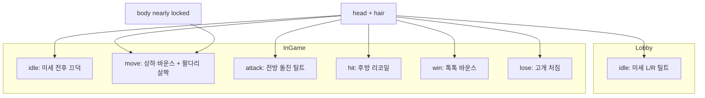

# 머리 중심 애니 기획 【확정 방향】

> **갱신:** 2026-07-21  
> **비율:** [04_INGAME_RATIO.md](./04_INGAME_RATIO.md) (향아 v6 고정)  
> **폴더:** [sprites/](./sprites/)  
> **원칙:** 자동차 대시보드 **보블헤드** — **몸은 거의 고정, 머리(+머리카락)가 애니의 주연**

---

## 0. 한 줄

> 어떤 동작이든 **머리가 말한다.**  
> 몸은 받침(스티커 받침판). 이동만 팔·다리를 **살짝** 보조.

---

## 0.5 외곽선 · 스케일 【확정】

| 항목 | 규칙 |
|------|------|
| 로비 | 흰 스티커 보더 |
| 인게임 | **검정 라인** · 투명 배경 |
| 스케일 | 한 캐릭터 = **전 동작·전 프레임 동일 크기** · 발/pivot 고정 · 시트 셀 안에 “떠다니며 축소확대” 금지 |

---

## 1. 제작 세트 (캐릭터당)

| # | 슬롯 | 뷰 | 폴더 | 시트 |
|---|------|-----|------|------|
| 1 | **로비 idle** | 정면 | `{char}/lobby/idle/` | 6프레임 1장 |
| 2 | **인게임 idle** | 3/4 옆 | `{char}/ingame/idle/` | 6프레임 1장 |
| 3 | **인게임 move** | 3/4 옆 | `{char}/ingame/move/` | 달리기 루프 |
| 4 | **인게임 hop** | 3/4 옆 | `{char}/ingame/hop/` | **4프레임** (점프·덤블·착지중·착지) |
| 5 | **인게임 attack** | 3/4 옆 | `{char}/ingame/attack/` | 키포즈 |
| 6 | **인게임 hit** | 3/4 옆 | `{char}/ingame/hit/` | 키포즈 |
| 7 | **인게임 win** | 3/4 옆 | `{char}/ingame/win/` | 키포즈 |
| 8 | **인게임 lose** | 3/4 옆 | `{char}/ingame/lose/` | 키포즈 |

**hop:** Monopoly Go 토큰 칸이동 — 공중 덤블 시 **몸 회전 허용**. 상세는 `sprites/{char}/ingame/hop/README.md`

기준 포즈(인게임): `sprites/hyanga/ingame/idle/hyanga_ingame_idle_pose.png` (= v6)

---

## 2. 공통 리깅 규칙

| 파츠 | 역할 |
|------|------|
| **head** | 위치·각도 애니 주체 |
| **hair** | head에 붙음 · secondary (관성·찰랑) |
| **face** | head에 붙음 · 표정은 최소(눈 반짝 정도) |
| **body** | **거의 고정** (이동 시에만 미세 bounce 허용) |
| **arm / leg** | **이동만** 살짝 순환 · 그 외 애니에서는 사실상 고정 |

보블 이음새: 머리↔몸 사이 **스티커 경계** 유지 (스프링 그리지 않음).

---

## 3. 슬롯별 — 머리를 어떻게 쓰나

### 3.1 로비 idle (정면)

| 항목 | 내용 |
|------|------|
| 느낌 | 카드북·로비 마스코트 · 보블헤드 **은은한** 흔들림 |
| 머리 | **좌↔우 미세 틸트** (±4~6°, 과하지 않게) |
| 머리카락 | 머리보다 반 프레임 늦게 따라옴 (secondary) |
| 몸 | 완전 고정 |
| 팔다리 | 고정 |
| 6키 | 중앙 → 살짝L → 조금L → 중앙 → 살짝R → 조금R |
| 루프 | ping-pong · ~8fps |

> 예전에 정면 6시트로 시범한 그 양식. 각만 **더 작게** 유지.

---

### 3.2 인게임 idle (3/4 옆) 【대기】

| 항목 | 내용 |
|------|------|
| 느낌 | 무대에서 “살아 있음” · **크게 좌우로 흔들 필요 없음** |
| 머리 | **아주 작은 전후 끄덕 + 미세 틸트** 혼합 (보블이지만 폭↓) |
| 추천 키 (6) | 0 기본 → 1 살짝 앞으로 → 2 기본 → 3 살짝 뒤로 → 4 기본 → 5 머리카락만 살짝 흔들림 |
| 대안 | 순수 미세 L/R (±3°)만 — 로비보다 더 약하게 |
| 몸 | 고정 |
| 팔다리 | 고정 |

**채택안:** **끄덕(전후) 위주 + 머리카락 secondary**  
(옆보기에서 좌우 큰 틸트는 얼굴이 묻히고 과해 보임)

---

### 3.3 인게임 move (이동)

| 항목 | 내용 |
|------|------|
| 머리 | **걸음에 맞춘 상하 바운스** (주 연출) · 착지 때 살짝 숙였다가 핌 |
| 머리카락 | 바운스 반대 방향 관성 |
| 몸 | **미세** 상하 (±2~4px)만 허용 — “거의 안 움직임” 유지 |
| 팔 | 앞↔뒤 **살짝** 스윙 (2포즈 교차) |
| 다리 | 교대 **살짝** 들기 (스텁 다리) |
| 4키 | 왼발+머리↑ → 중간+머리↓ → 오른발+머리↑ → 중간+머리↓ |

머리 바운스가 없으면 이동이 안 읽힘 → **머리 = 보폭의 메트로놈**.

---

### 3.4 인게임 attack — **A 돌진 / B 마법** (팔·무기 금지)

상세: [sprites/hyanga/ingame/attack/README.md](./sprites/hyanga/ingame/attack/README.md)

#### Attack A — hairball 돌진

| 항목 | 내용 |
|------|------|
| 컨셉 | 접근(빠른 move) → **웅크림** → **머리카락 공** 들이받기 → 풀며 복귀 |
| 머리/헤어 | 공 형태가 타격 본체 (hop 공중과 톤 맞춤) |
| 몸 | crouch에서 압축 · fly/hit는 헤어볼 · return에서 콘 복귀 |
| 4키 | `crouch` → `fly` → `hit` → `return` |

#### Attack B — 제자리 헤어 캐스트

| 항목 | 내용 |
|------|------|
| 컨셉 | 자리 不動 · 머리카락이 **위로 치솟았다가 내려오며** 마법 |
| 머리/헤어 | charge → peak(최대 상승) → release |
| 몸 | idle과 동일 고정 |
| 3키 | `charge` → `peak` → `release` |

---

### 3.5 인게임 hit (피격)

| 항목 | 내용 |
|------|------|
| 머리 | **뒤로 튕김** + 살짝 위로 |
| 머리카락 | 앞으로 출렁 (관성) |
| 몸 | 고정 |
| 3키 | 기본 → 헤드 리코일 → 비틀/깜빡 후 복귀 직전 |

---

### 3.6 인게임 win (승리)

| 항목 | 내용 |
|------|------|
| 머리 | **가벼운 톡톡 바운스** (기쁨) · 살짝 위 |
| 머리카락 | 통통 따라 튐 |
| 몸 | 고정 |
| 3키 | 기본 → 머리↑ → 착지(기본보다 살짝 들뜬 포즈 홀드) |

---

### 3.7 인게임 lose (패배)

| 항목 | 내용 |
|------|------|
| 머리 | **아래로 축 처짐** (힘 빠짐) |
| 머리카락 | 무게 있게 늘어짐 |
| 몸 | 고정 |
| 3키 | 기본 → 고개 숙임 → 완전 처진 홀드 |

---

## 4. 한눈에 보는 머리 모션 맵



---

## 5. 폴더 구조 (배치 제작용)

```
docs/art/sprites/
  _shared/
    ratio_locked_hyanga_v6.png     # 비율 황금본
  hyanga/                          # 메인부터
    _ref/                          # 정면 스티커 등
    _wip/                          # 컨셉 이력
    lobby/idle/
    ingame/idle|move|attack|hit|win|lose/
  generals/{char_id}/              # 동일 트리
    _ref/ _wip/ lobby/ idle… 
```

파일명 예:
- `hyanga_lobby_idle_6frame_sheet.png`
- `hyanga_ingame_idle_6frame_sheet.png`
- `hyanga_ingame_move_4frame_sheet.png`
- …

---

## 6. 제작 순서 (앞으로)

1. **향아** 인게임 idle 6시트 (끄덕 위주 · 각 작게)  
2. 향아 move → attack → hit → win → lose  
3. 향아 로비 idle 재확인/각 축소(기존 시트 있으면 검수)  
4. 장수 10명 — 같은 머리 모션 템플릿으로 복제  

그림은 **이 기획 확인 후** 하나씩.

---

## 7. 하지 않는 것

- 몸통 전체 회전·큰 점프  
- 팔로 때리는 공격이 메인이 되는 연출  
- 인게임 idle의 큰 좌우 흔들림  
- 스프링/목 관절 비주얼
